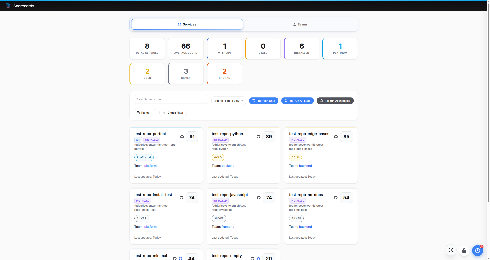
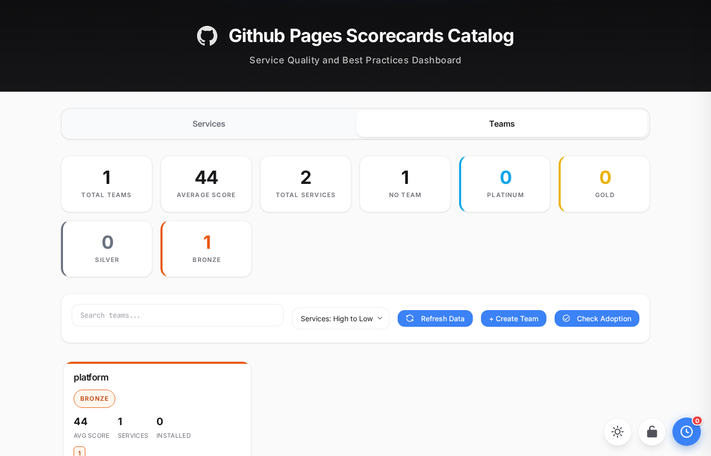
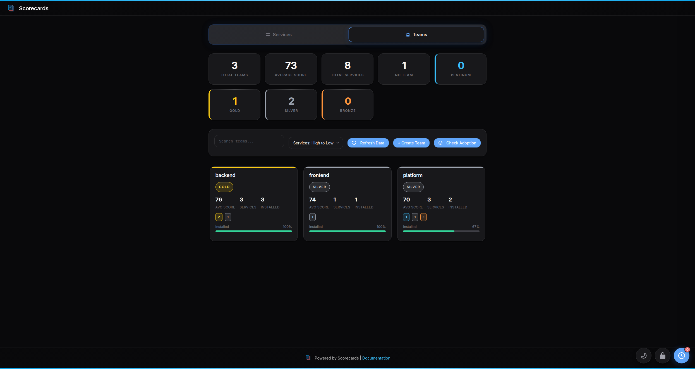

# Scorecards

**Lightweight, GitHub-native quality measurement for service repositories.**

Measure service quality against configurable standards and make results visible in a centralized catalog—without infrastructure overhead or per-service configuration.



## Quick Start

**One-liner install for your organization:**

```bash
export GITHUB_TOKEN=your_github_pat
curl -fsSL https://raw.githubusercontent.com/feddericovonwernich/scorecards/main/scripts/install.sh | bash
```

This creates a repository with GitHub Actions, catalog UI on GitHub Pages, and results storage. Services get scored immediately with no additional configuration required.

---

## Features

### Catalog UI

- **Dual-view dashboard** - Switch between Services and Teams views
- **Dark mode** - Full theme support with OS preference detection
- **Real-time Actions widget** - Monitor GitHub Actions workflow runs live
- **Advanced filtering** - Include/exclude by rank, API presence, staleness, or specific checks
- **Service detail modals** - View check results, API specs, workflows, and contributors
- **Badge generation** - Embed shields.io-compatible badges in your READMEs



### Team Management

- **Team dashboards** - Aggregate statistics across team services
- **Check adoption tracking** - See which checks each team has adopted
- **Service ownership** - Assign services to teams via CODEOWNERS or config

### Quality Checks

- **12 built-in checks** covering documentation, testing, CI, APIs, and compliance
- **Weighted scoring** with 4-tier ranks: Platinum (90+), Gold (75-89), Silver (50-74), Bronze (0-49)
- **Multi-language support** - Checks written in Bash, Python, or JavaScript
- **8 CI systems detected** - GitHub Actions, Travis, GitLab, CircleCI, Jenkins, Drone, Azure, Bitbucket

### API Documentation

- **OpenAPI spec detection** - Automatically finds and validates specs
- **Integrated Swagger UI** - Browse APIs in the API Explorer
- **Environment configuration** - Checks for proper API environment setup



---

## How It Works

1. **Add the workflow** - Services opt-in by adding a GitHub Actions workflow
2. **Checks run automatically** - Daily (or on push) the action runs 12 quality checks
3. **Results publish to catalog** - Scores appear in your GitHub Pages catalog
4. **Teams improve over time** - Non-blocking feedback encourages incremental improvement

**Scoring formula:** `(passed check weights / total weights) × 100`

Each check has a weight reflecting its importance. Higher-weighted checks (like tests and CI) have more impact on the final score.

---

## When to Use Scorecards

**Choose Scorecards if you:**

- Want to start measuring quality today without a big project
- Are a small/medium team (1-50 services) without dedicated platform engineers
- Use GitHub and want to leverage existing Actions infrastructure
- Need a free, lightweight solution or proof-of-concept
- Want to supplement existing tools with focused quality checks

**Considering enterprise tools?** See our [comparison guide](documentation/comparison.md) for an honest look at Scorecards vs. Backstage and Cortex.

---

## Documentation

### Setup Guides
- **[Platform Installation](documentation/guides/platform-installation.md)** - Set up Scorecards for your organization
- **[Service Installation](documentation/guides/service-installation.md)** - Add Scorecards to your service
- **[Configuration Guide](documentation/guides/configuration.md)** - Customize your setup

### Reference
- **[Action Reference](documentation/reference/action-reference.md)** - Action inputs, outputs, badges
- **[Check Development Guide](documentation/guides/check-development-guide.md)** - Create custom checks
- **[Comparison Guide](documentation/comparison.md)** - Scorecards vs. Backstage vs. Cortex
- **[Architecture](documentation/architecture/overview.md)** - System design and flows

### For Service Teams

Add this workflow to your service repository:

```yaml
# .github/workflows/scorecards.yml
name: Scorecards

on:
  schedule:
    - cron: '0 0 * * *'  # Daily
  workflow_dispatch:

jobs:
  scorecards:
    runs-on: ubuntu-latest
    steps:
      - uses: actions/checkout@v4
      - name: Run Scorecards
        uses: feddericovonwernich/scorecards/action@main
        with:
          github-token: ${{ secrets.SCORECARDS_CATALOG_TOKEN }}
          scorecards-repo: 'your-org/scorecards'
```

---

## Token Requirements

| Token | Purpose | Required Scopes |
|-------|---------|-----------------|
| `SCORECARDS_CATALOG_TOKEN` | Write results to catalog | `repo` |
| `SCORECARDS_WORKFLOW_TOKEN` | Create PRs with workflows (optional) | `repo`, `workflow` |

See [Token Requirements Guide](documentation/guides/token-requirements.md) for setup instructions.

---

## Contributing

We welcome contributions! See [CONTRIBUTING.md](CONTRIBUTING.md) for guidelines.

To add a new check:
1. Create a script in `checks/your-check/check.sh`
2. Add metadata in `checks/your-check/metadata.json`
3. Add tests
4. Submit a PR

See the [Check Development Guide](documentation/guides/check-development-guide.md) for details.

---

## License

[PolyForm Shield 1.0.0](https://polyformproject.org/licenses/shield/1.0.0/) - Free to use, but you cannot use this software to compete with Scorecards or offer it as a competing service.
