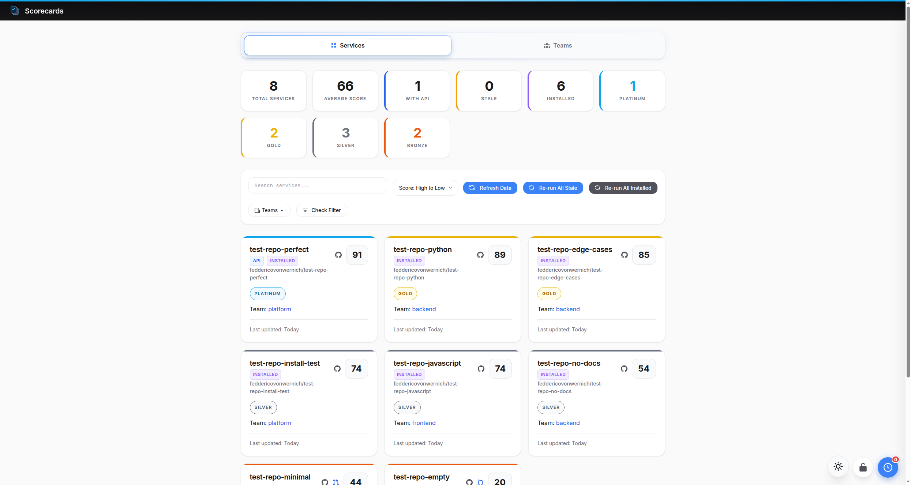
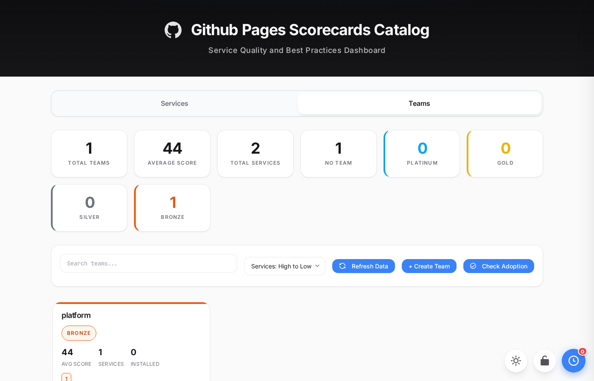
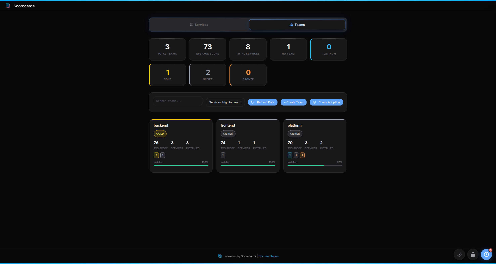

# Scorecards

**Lightweight, GitHub-native quality measurement for service repositories.**

Measure service quality against configurable standards and make results visible in a centralized catalog—without infrastructure overhead or per-service configuration.



## Quick Start

Install from the full SHA published by a reviewed Scorecards release:

```bash
export GITHUB_TOKEN=your_github_pat
export SCORECARDS_RELEASE_SHA='<40-character release SHA>'
export SCORECARDS_TARGET_REPO='your-org/scorecards'
export SCORECARDS_SINGLE_WRITER=true

: "${SCORECARDS_RELEASE_SHA:?copy the full SHA from the release}"
[[ "$SCORECARDS_RELEASE_SHA" =~ ^[0-9a-f]{40}$ ]] || exit 1
(
  set -euo pipefail
  SOURCE_DIR="$(mktemp -d)"
  trap 'status=$?; rm -rf "$SOURCE_DIR"; exit "$status"' EXIT
  git -C "$SOURCE_DIR" init
  git -C "$SOURCE_DIR" fetch \
    https://github.com/feddericovonwernich/scorecards.git "$SCORECARDS_RELEASE_SHA"
  git -C "$SOURCE_DIR" checkout --detach FETCH_HEAD
  SCORECARDS_SOURCE_SHA="$SCORECARDS_RELEASE_SHA" bash "$SOURCE_DIR/scripts/install.sh"
)
```

The installer supports only a new or explicitly adopted empty `scorecards` repository. It requires exclusive installation writing, rejects populated repositories, and publishes `main` and `catalog` atomically without tags before verifying a fresh workflow-based Pages deployment. For the release-provenance, empty-repository, Pages-verification, and forward-only recovery contract, see the [Platform Installation Guide](documentation/guides/platform-installation.md). Then follow the [first-service gate](documentation/guides/service-installation.md#step-4-verify-the-first-service-end-to-end).

---

## Features

### Catalog UI

- **Dual-view dashboard** - Switch between Services and Teams views
- **Dark mode** - Full theme support with OS preference detection
- **Real-time Actions widget** - Monitor GitHub Actions workflow runs live
- **Advanced filtering** - Include/exclude by rank, API presence, staleness, or specific checks
- **Service detail modals** - View check results, API specs, workflows, and contributors
- **Badge generation** - Embed shields.io-compatible badges in your READMEs
- **Optional PR-only remediation** - Deterministic corrections for eligible failed checks; see [activation policy and security prerequisites](documentation/architecture/flows/remediation-flow.md#activación-prerrequisitos-externos-obligatorios)



### Team Management

- **Team dashboards** - Aggregate statistics across team services
- **Check adoption tracking** - See which checks each team has adopted
- **Service ownership** - Assign services to teams via CODEOWNERS or config

### Quality Checks

- **12 built-in checks** covering documentation, testing, CI, APIs, and compliance
- **Weighted scoring** with 4-tier ranks: Platinum (90+), Gold (75-89), Silver (50-74), Bronze (0-49)
- **Multi-language support** - Checks written in Bash, Python, or JavaScript
- **8 CI systems detected** - GitHub Actions, Travis, GitLab, CircleCI, Jenkins, Drone, Azure, Bitbucket

### API Documentation

- **OpenAPI spec detection** - Automatically finds and validates specs
- **Integrated Swagger UI** - Browse APIs in the API Explorer
- **Environment configuration** - Checks for proper API environment setup



---

## How It Works

1. **Add the workflow** - Services opt-in by adding a GitHub Actions workflow
2. **Checks run automatically** - Daily (or on push) the action runs 12 quality checks
3. **Results publish to catalog** - Scores appear in your GitHub Pages catalog
4. **Teams improve over time** - Non-blocking feedback encourages incremental improvement

**Scoring formula:** `(passed check weights / total weights) × 100`

Each check has a weight reflecting its importance. Higher-weighted checks (like tests and CI) have more impact on the final score.

---

## When to Use Scorecards

**Choose Scorecards if you:**

- Want to start measuring quality today without a big project
- Are a small/medium team (1-50 services) without dedicated platform engineers
- Use GitHub and want to leverage existing Actions infrastructure
- Need a free, lightweight solution or proof-of-concept
- Want to supplement existing tools with focused quality checks

**Considering enterprise tools?** See our [comparison guide](documentation/comparison.md) for an honest look at Scorecards vs. Backstage and Cortex.

---

## Documentation

Follow one route:

1. [Install the platform](documentation/guides/platform-installation.md).
2. [Onboard and verify the first service](documentation/guides/service-installation.md#step-4-verify-the-first-service-end-to-end).
3. [Author checks and optional remediations](documentation/guides/check-development-guide.md).
4. Agent contributors use the versioned
   [`creating-scorecards-checks`](.agents/skills/creating-scorecards-checks/SKILL.md)
   and
   [`creating-scorecards-remediations`](.agents/skills/creating-scorecards-remediations/SKILL.md)
   skills.

The [Action Reference](documentation/reference/action-reference.md) owns runtime
inputs and outputs. The [architecture documentation](documentation/architecture/overview.md)
explains system flows and remediation security; it does not replace the
installation or authoring walkthroughs.

See the
[combined verification record](documentation/reference/installation-authoring-verification.md)
for local I01–I10/D01–D06 evidence and the cloud scenarios that remain unproven.

---

## Token Requirements

See the [Token Requirements Guide](documentation/reference/token-requirements.md) for catalog publication, installation and remediation permissions, setup instructions and security prerequisites.

---

## Contributing

See [CONTRIBUTING.md](CONTRIBUTING.md). Check and remediation changes follow the
[Check Development Guide](documentation/guides/check-development-guide.md) and
the repository skills linked above; metadata and supported values remain owned
by the executable validator.

---

## License

[PolyForm Shield 1.0.0](https://polyformproject.org/licenses/shield/1.0.0/) - Free to use, but you cannot use this software to compete with Scorecards or offer it as a competing service.
